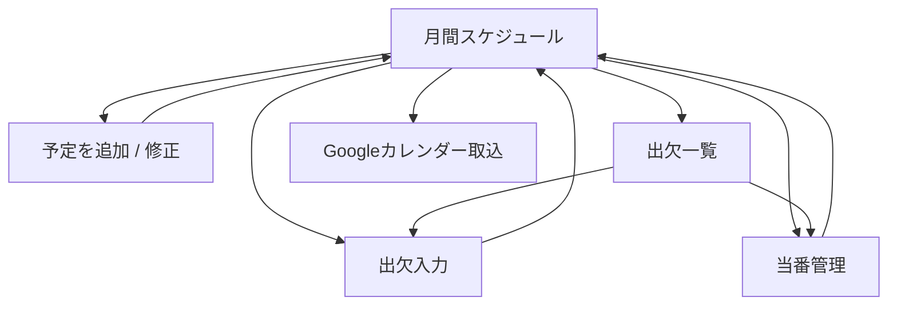
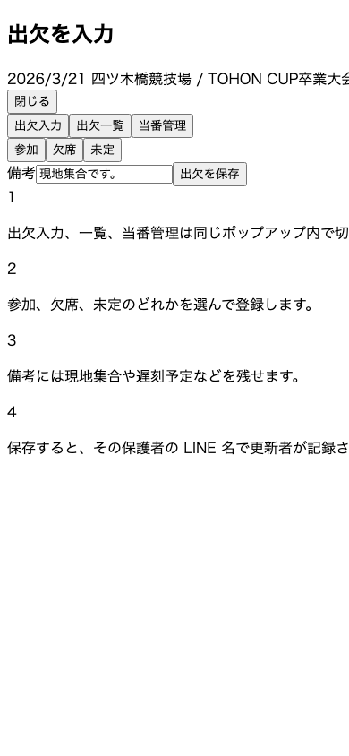
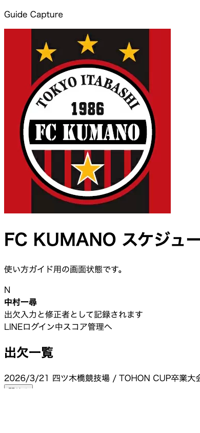
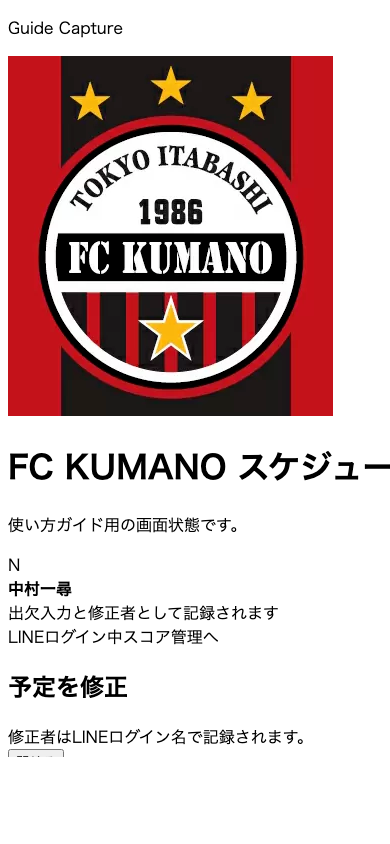

# スケジュール管理 使い方

## 画面フロー

## 1. 月間予定を見る

スマホで開くとトップはスケジュール管理です。`表示月`、`表示切替`、`学年` を選び、その下で月間予定を確認します。

見方:
1. `1` 表示月で対象月を切り替えます。
2. `2` 表示切替で `短縮 / 通常` を選びます。
3. `3` 予定表を取り込むから CSV を選びます。
4. `4` 一覧で各予定の内容を確認します。
5. `5` Googleカレンダー取込で現在表示中の予定を書き出します。

## 2. 出欠を入力する

見方:
1. `1` 出欠入力タブが開いていることを確認します。
2. `2` 参加、欠席、未定のどれかを選びます。
3. `3` 必要なら備考を入れます。
4. `4` 出欠を保存で確定します。

補足:
- 出欠入力は LINE ログイン名で保存されます。
- セッション切れの場合は再ログインに進みます。

## 3. 出欠一覧を見る

見方:
1. `1` 上段で参加、欠席、未定の人数を確認します。
2. `2` フィルタチップで見たい対象に絞ります。
3. `3` 表で選手ごとの状態と入力者を確認します。

## 4. 当番を決める

見方:
1. `1` 当番担当者を選びます。
2. `2` メモに集合時間や役割を書きます。
3. `3` 決定者と決定日時を確認します。
4. `当番を保存` を押して反映します。

補足:
- 決定者と決定日時は当番モーダル内で確認できます。
- 一覧表の当番欄には担当者名だけが出ます。

## 5. 予定を追加・修正する

見方:
1. `1` 日付、タグ、場所、内容を入力します。
2. `2` 時間未定なら開始と終了に `-` を入れます。
3. `3` 試合なら `試合として扱う` をオンにします。
4. `4` 保存または更新を押します。

補足:
- 修正者は LINE ログイン名で記録されます。
- 試合として登録した予定は、スコア管理へ遷移したときの初期値に使われます。

## 6. Googleカレンダーへ取り込む

トップ画面の一番下に `Googleカレンダー取込` があります。

補足:
- 書き出し対象は、現在の `表示月` と `学年` の絞り込み結果です。
- Googleカレンダーへ取り込み後、このアプリとは同期されません。
