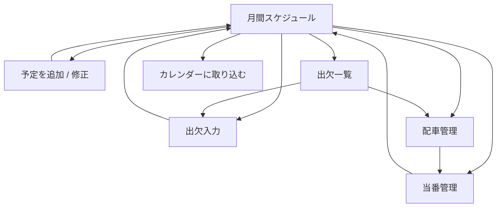
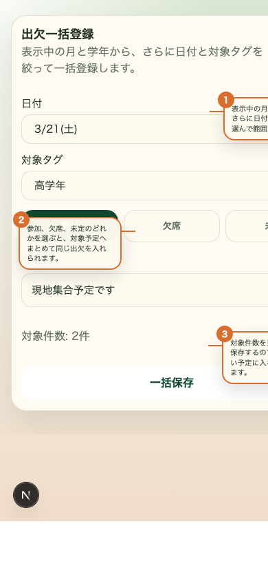
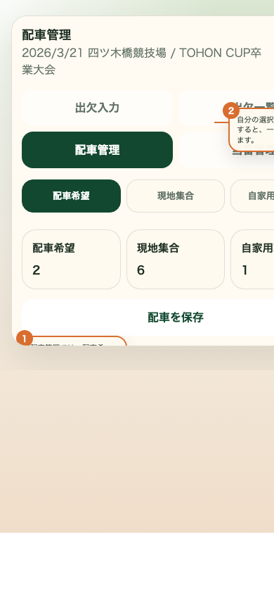

# スケジュール管理 使い方

## 画面フロー

## 1. 月間予定を見る

スマホで開くとトップはスケジュール管理です。`表示月`、`表示切替`、`学年` を選び、その下で月間予定を確認します。

見方:
1. `1` 表示月で対象月を切り替えます。
2. `2` 表示切替で `短縮 / 通常` を選びます。
3. `3` 予定表を取り込むから CSV を選びます。
4. `4` 一覧で各予定の内容を確認します。
5. `5` カレンダーに取り込む で現在表示中の予定を書き出します。

補足:
- 通常表示の `操作` には `出欠 / 一覧 / 配車 / 当番 / 修正 / 削除` が並びます。
- 右上の `出欠一括登録` から、表示中の月・学年に対してまとめて出欠を入れられます。
- 場所が `板七小` の予定では `配車` は表示されません。
- `予定表を取り込む` と `カレンダーに取り込む` は一覧の下部にあります。
- CSV 取り込みでは、`日付 / 開始 / 終了 / 場所 / 内容 / タグ` が完全一致する予定は自動でスキップします。

## 1.5 予定表を取り込む

`/guide/schedule?view=import` に取込専用ガイドがあります。

最低限必要な列:
- `日付`
- `学年`
- `時間`
- `場所`
- `内容`

書き方の目安:
- `日付` は `YYYY-MM-DD`、`YYYY/MM/DD`、`4/18` のような月日だけでも可
- `学年` は `キッズ`、`低学年`、`3年`、`2・3年`、`2〜6年` のような表記に対応
- `時間` は `09:00 - 11:00`、または未定なら `-`
- `場所` は空欄不可
- `内容` は空欄不可

補足:
- ヘッダは `日付 / 学年 / 時間 / 場所 / 内容` を推奨します。
- 英字ヘッダの `date / grade / time / location / content` でも読み取れます。
- `日付 / 開始 / 終了 / 場所 / 内容 / タグ` が完全一致する予定は重複としてスキップされます。
- `1年` のような表記からは `低学年` などの帯タグも自動補完されます。
- `4/18` のように年がない日付は、その年の日本時間の今年として扱います。
- サンプルCSV: [schedule-import-sample.csv](/Users/kazuhiro/Documents/score-manager/public/schedule-import-sample.csv)

## 2. 出欠を入力する

見方:
1. `1` 出欠入力タブが開いていることを確認します。
2. `2` 参加、欠席、未定のどれかを選びます。
3. `3` 必要なら備考を入れます。
4. `4` 出欠を保存で確定します。

補足:
- 出欠入力は LINE ログイン名で保存されます。
- セッション切れの場合は再ログインに進み、PC ではログインボタンを再表示します。

## 3. 出欠を一括登録する

`出欠一括登録` から開きます。

見方:
1. 日付と対象タグをチェックボックスで複数選択し、一括登録の範囲を絞ります。
2. `参加 / 欠席 / 未定` のどれかを選びます。
3. 必要なら共通の備考を入れます。
4. `対象件数` を確認して `一括保存` を押します。

補足:
- 一括登録は、現在の `表示月` と `学年` の絞り込み結果に対して行います。
- そこからさらに `日付` と `対象タグ` を複数選択で絞れます。
- どちらも未選択なら、表示中の予定すべてが対象です。

## 4. 出欠一覧を見る

見方:
1. `1` 上段で参加、欠席、未定の人数を確認します。
2. `2` フィルタチップで見たい対象に絞ります。
3. `3` 表で選手ごとの状態と入力者を確認します。

## 5. 配車管理を入力する

通常表示の `操作` にある `配車` から開きます。

見方:
1. `配車希望 / 現地集合 / 自家用車同乗可` のいずれかを選びます。
2. `配車を保存` を押して反映します。
3. モーダル下部の一覧で、保護者ごとの入力状況を確認します。

補足:
- 配車入力も LINE ログイン名で保存されます。
- `板七小` の予定では配車管理を使いません。

## 6. 当番を決める

見方:
1. `1` 当番担当者を選びます。
2. `2` メモに集合時間や役割を書きます。
3. `3` 決定者と決定日時を確認します。
4. `当番を保存` を押して反映します。

補足:
- 決定者と決定日時は当番モーダル内で確認できます。
- 一覧表の当番欄には担当者名だけが出ます。

## 7. 予定を追加・修正する

見方:
1. `1` 日付、タグ、場所、内容を入力します。
2. `2` 時間未定なら開始と終了に `-` を入れます。
3. `3` 試合なら `試合として扱う` をオンにします。
4. `4` 保存または更新を押します。

補足:
- 修正者は LINE ログイン名で記録されます。
- 試合として登録した予定は、スコア管理へ遷移したときの初期値に使われます。

## 8. カレンダーへ取り込む

トップ画面の一番下に `カレンダーに取り込む` があります。

補足:
- 書き出し対象は、現在の `表示月` と `学年` の絞り込み結果です。
- まず `icsファイルをダウンロード` を押し、保存した `.ics` を端末のファイルから開いてカレンダーへ取り込みます。
- iPhone の Safari では、Googleカレンダーへ直接入るのではなくダウンロード動作になることがあります。
- Googleカレンダーへ確実に入れる場合は、PC 版 Googleカレンダーで `.ics` を取り込む方法が最も安定します。
- 取り込み後、このアプリとは同期されません。
