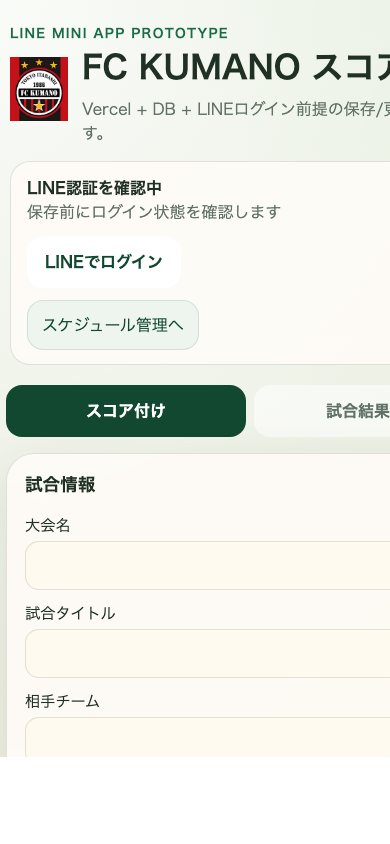

# スコア管理 使い方

スコア管理は `/score` で使います。試合中のスコア入力と、試合結果一覧の確認・修正ができます。

## 1. スコア入力を始める

1. `大会名`、`試合タイトル`、`相手チーム` を入力します。
2. `年代タグ` と `日付` を設定します。
3. 必要なら `前後半`、`PK戦` を選びます。

補足:
- スケジュール管理から `スコア管理` へ入ると、日付やタグなどが初期入力された状態で開けます。

## 2. タイマーを使う

1. `スタート` で計測開始
2. `ストップ` で停止
3. `リセット` で 00:00 に戻します

## 3. ゴールを記録する

1. 自チーム得点なら `ゴールを追加`
2. 相手チーム得点なら `失点を追加`
3. 自チーム得点時は `得点選手` を選択できます

補足:
- 得点ログは下に追加されます。
- 得点の取り消しや得点選手の修正も可能です。

## 4. 試合結果を保存する

1. 入力が終わったら `試合結果を保存` を押します。
2. 修正中なら `試合結果を更新` になります。

補足:
- 保存、更新、削除は LINE ログインが必要です。
- セッション切れ時は再ログインへ進むことがあります。

## 5. 選手を登録する

1. 右側の `選手登録` に `背番号` と `名前` を入れます。
2. タグを選びます。
3. `保存` します。

## 6. 試合結果一覧を見る

1. 上部タブで `試合結果一覧` を選びます。
2. 月や学年で絞り込みできます。
3. 並び順変更、CSV入出力、ランキング確認ができます。

## 7. 試合結果を修正・削除する

1. 一覧から対象試合の `修正` または `削除` を押します。
2. 修正時は入力画面へ戻るので、更新後に保存します。
3. `修正を取り消す` で編集状態を破棄できます。

## 8. CSV を使う

1. `CSVを書き出す` で試合結果を保存できます。
2. `CSVを取り込む` で既存試合結果を追加できます。

補足:
- 試合結果 CSV は Excel で開ける UTF-8 BOM 付きです。
