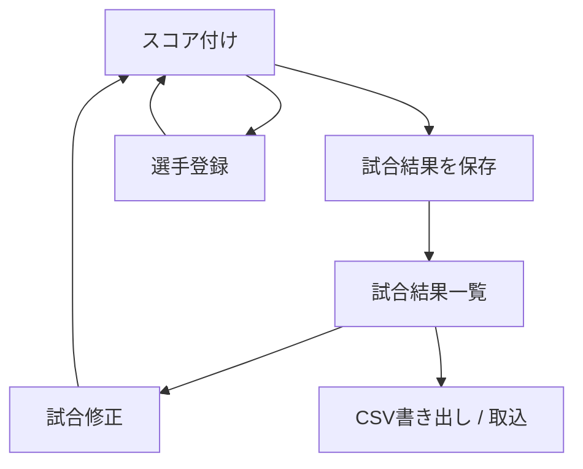
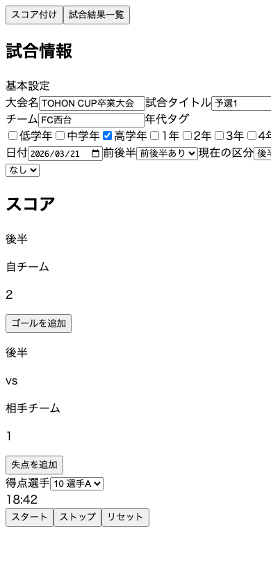
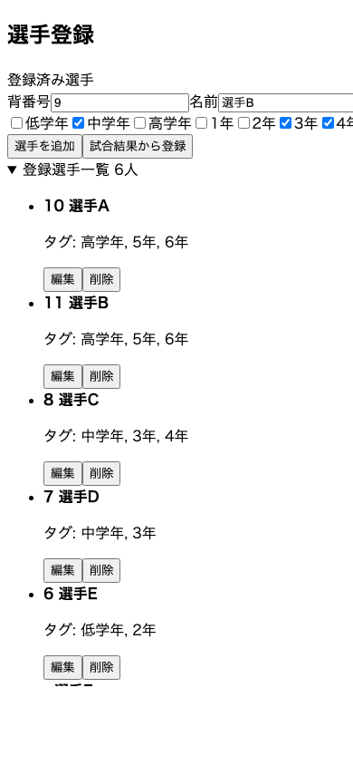
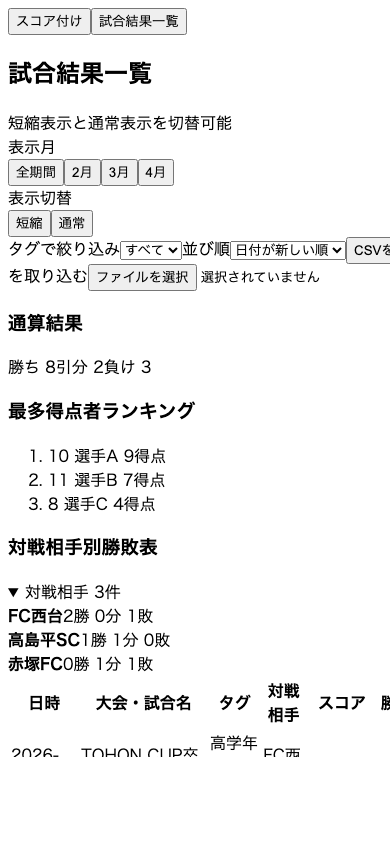

# スコア管理 使い方

## 画面フロー

## 1. スコアを入力する

`/score` では、試合情報、スコア、選手登録を1画面で扱えます。

見方:
1. `1` 試合情報を先に入力します。
2. `2` ゴール追加と失点追加でスコアを記録します。
3. `3` タイマーで試合時間の目安を取ります。
4. `4` ゴールログで得点内容を確認します。
5. `5` 保存で試合結果一覧へ送ります。

補足:
- スケジュール管理の試合から入ると、日付やタグなどが初期入力された状態で開けます。
- タイマーは `スタート / ストップ / リセット` で操作します。
- ゴールログは自動保存されます。

## 2. 選手を登録する

見方:
1. `1` 背番号、名前、タグを入力して追加します。
2. `2` 試合結果から登録で既存得点者をまとめて追加します。
3. `3` 登録選手一覧を開いて確認、編集、削除を行います。

補足:
- 同じ名前でも学年タグが違えば別選手として扱います。
- 背番号が未入力でも、`アオト (1年)` と `アオト (2年)` のように区別して表示します。
- 毎年 `4月1日` になると、`1年 → 2年` のように自動で繰り上がります。
- `キッズ` は自動繰り上がりの対象外です。
- `6年` タグの選手は卒業扱いで自動削除されます。

## 3. 試合結果一覧を見る

見方:
1. `1` 表示月と表示切替を選びます。
2. `1` の表示月には `全期間` もあり、月をまたいで確認できます。
3. `2` タグと並び順で見たい試合だけに絞ります。
4. `3` サマリーで通算結果やランキングを確認します。
5. `4` 一覧でスコア、勝敗、得点者を確認します。

補足:
- `短縮` では文字が小さくなり、`保存者 / 更新者` と `操作` 列が非表示になります。
- `通算結果`、`最多得点者ランキング`、`対戦相手別勝敗表` も同じ条件で再集計されます。

## 4. 試合結果を修正する

見方:
1. `1` 既存のゴールログを編集します。
2. `2` 不要な得点は取り消します。
3. `3` 更新をやめるなら修正を取り消します。
4. `4` 問題なければ試合結果を更新します。

補足:
- 保存、更新、削除は LINE ログインが必要です。
- セッション切れの場合は再ログインに進みます。

## 5. CSV を使う

試合結果一覧には `CSVを書き出す` と `CSVを取り込む` があります。

補足:
- 書き出しは現在の絞り込み結果が対象です。
- 取り込みは既存の参考 CSV 形式に合わせています。
- 出力 CSV は Excel で開ける UTF-8 BOM 付きです。
